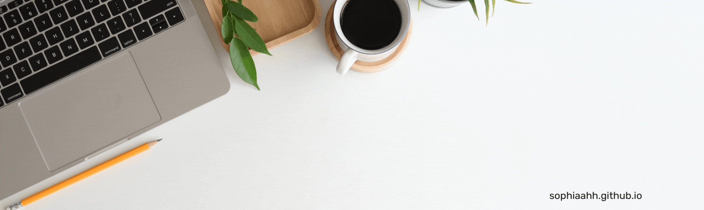

🔭 I’m currently working on machine learning projects and contributing to the open-source community   
⚡ Research Interests: deep learning algorthims, AI, data mining, data visualization   
💬 Ask me about anything!   
😄 Pronouns: she/her   
✨ Fun fact: I love cooking 👩‍🍳 creating art 🎨 gardening 🌱 and blogging 🖊️   

<!--
**sophiaahh/sophiaahh** is a ✨ _special_ ✨ repository because its `README.md` (this file) appears on your GitHub profile.

Here are some ideas to get you started:

- 🔭 I’m currently working on ...
- 🌱 I’m currently learning ...
- 👯 I’m looking to collaborate on ...
- 🤔 I’m looking for help with ...
- 💬 Ask me about ...
- 📫 How to reach me: ...
- 😄 Pronouns: ...
- ⚡ Fun fact: ...
-->
